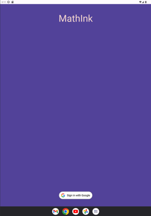
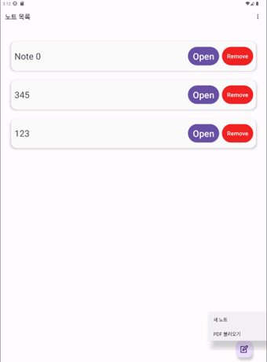
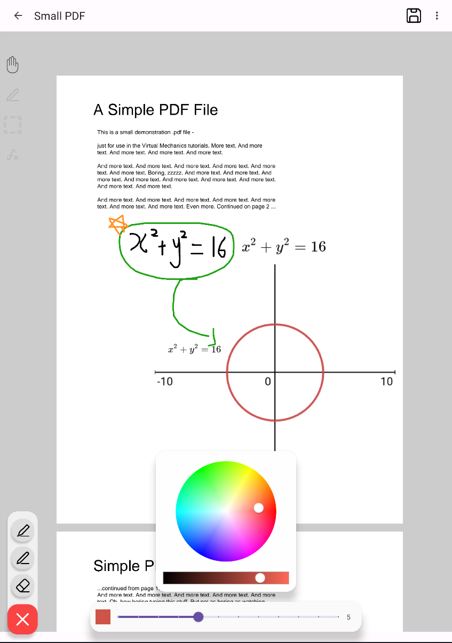
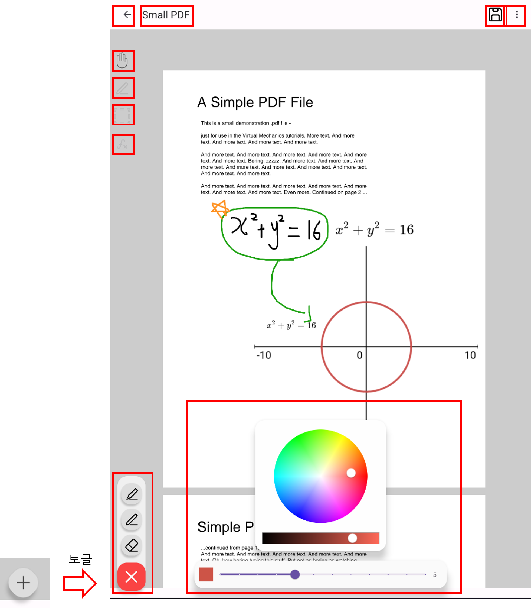
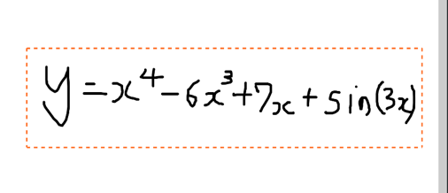
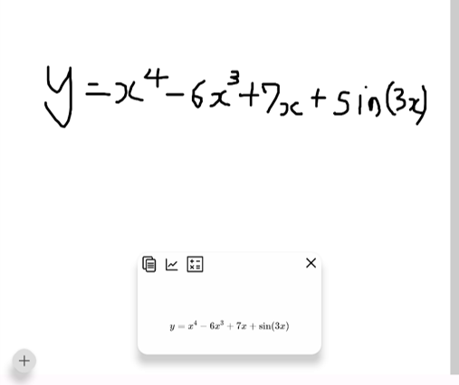
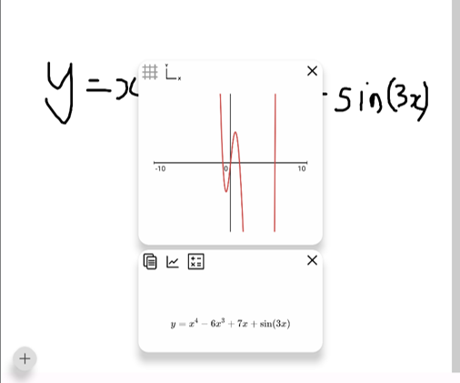
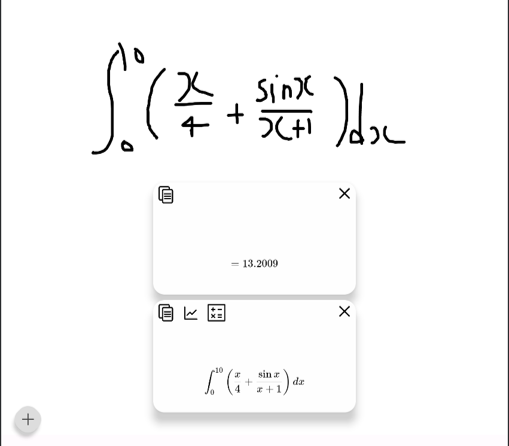
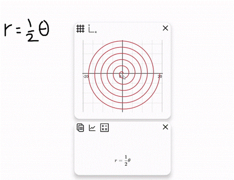

# 세부기능
 

## 1. 로그인 화면
 

 

* 최초 로그인 or 인증 실패 시 진입.

* Google OAuth를 통해 사용자 인증 및 PaaS-TA 인증 서버를 통해 Access token 발급, 메인메뉴로 전환

* 최초 로그인 이후에는 자동으로 로그인 및 인증, access token 갱신 진행

* 이후 서버와의 모든 통신은 발급받은 Access token을 이용해 PaaS-TA 내에 구축된 인증 서버를 거쳐 검증 후 진행

 

## 2. 메인 메뉴
 

 

* 진입 시 자동으로 클라우드와 연동하여 DB에 저장된 노트 목록 조회

* 클라우드에 저장된 노트 열람, 삭제 및 새로운 노트 생성 가능

* 노트 열람 시 클라우드 서버에서 json 형식의 노트 데이터 수집, 해당 데이터를 파싱하여 사용자에게 제공

* 새로운 노트 생성 시, 빈 노트를 생성하거나, PDF파일을 불러올 수 있음

* 노트 삭제 시 목록에서 해당 노트가 제거되고, 클라우드 서버에서도 실시간 연동되어 해당 데이터 삭제 진행

* 새로운 노트를 생성하거나, 저장된 노트를 조회하여 서버로부터 데이터를 로드한 후 노트 편집 창으로 전환

 

## 3. 노트 편집 창
 

 

* 빈 노트 혹은 PDF에서 불러온 페이지에서 사용자는 그림을 그리거나, 필기를 하거나, OCR 및 수식 처리 기능들을 활용할 수 있음

* 현재 펜, 형광펜, 지우개 기능 제공. 펜 색상 변경, 두께 변경 등 노트 앱으로서 기본적인 기능 제공

* 노트 창은 빈 영역, 캔버스 영역, 좌 상단 도구 선택 바, 하단부 확장 도구창, 상단 액션바로 구성

 

## 3-1. 노트 편집 기능
 

 

* 아이콘을 사용하여 직관적으로 노트의 기능을 이해할 수 있도록 구성

### 노트 편집 창에서 할 수 있는 핵심 기능
#### 1. 올가미로 선택
#### 2. 펜 색상 및 굵기 변경
#### 3. pdf 로드

 

## 4. OCR 기능
 

수식 인식기 도구를 사용하여 사용자가 필기한 노트를 OCR로 인식하여 수식으로 변환 가능

 

 

수식 인식기 도구를 선택 후 캔버스의 특정 영역을 드래그 할 시, 해당 영역의 필기를 인식하여 수식으로 변환

 
 

## 4-1. OCR 기능 연계
 

### 그래프

### 공학계산기

 

* 변환 된 수식은 그래프로 나타내거나, 계산 가능할 경우 계산 수행 가능

* 상단 좌측의 복사 버튼을 눌러 수식을 LaTex형식으로 클립보드에 저장 가능

 

### 복사

* 수식 및 그래프는 길게 터치하여 사용자의 노트로 복사 가능