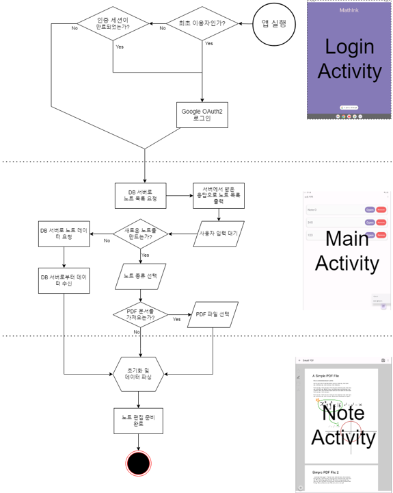
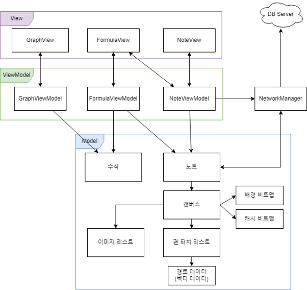
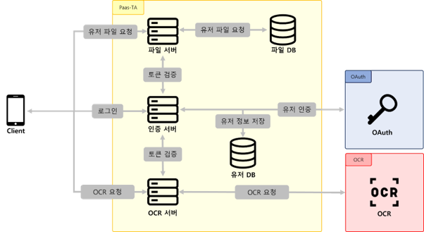

<h1>MATHINK</h1>

이공계열 학생을 위하여 OCR 기능을 활용한 안드로이드 기반의 수식 특화형 노트 필기앱

### 목적
* OCR을 통해 노트앱 이용 중 편리하게 수식 작성
* 노트앱 내에서 공학계산기 기능 사용
* 노트앱 내에서 자동 그래프 그리기

### 일정
* 23.11.24 ~ 23.12.16

### 인원
총 2인
* Android: 권성찬
* BE: 신형진

### 기능
[세부 기능 보기](DETAILFUNCTION.md)
 
 

## 개발 환경
### Android
* IDE: Android Studio 2033.3.1 
* JDK: JBR 17
* 최소 요구사항: 안드로이드 SDK 26 (Android 8.0 Oreo) 이상

### Backend
* IDE: IntelliJ IDEA
* Springboot: 2.7.4
* Java: 8
* MySQL: 8.0.x

 
 

## 기술 스택
### Android
* Kotlin
* JavaScript / Web view

### Backend
* Springboot
* Spring Data JPA
* Azure Database for MySQL
* Azure Cosmos DB for MongoDB

 

 
 

## Flow Chart
 
 

 
 

## 시스템 아키텍처
 

### Android 아키텍처
 

 
 
 

### Backend 아키텍처
 

## API
 

### OCR

| 종류 | Endpoint | Description | Header | Request payload |
|------|---------|-------------------------| ---------|------|
| OCR API | POST  /api/mathpix | 이미지->LaTeX OCR 요청  | | - access_token: String  - img: String |

   

### AUTH

| 종류 | Endpoint | Description | Header | Request payload |
|------|---------|-------------------------| ---------|------|
| AUTH API | GET  /api/auth | access_token 인증 요청  | | - access_token: String|
| | GET  /api/revoke | access_token 취소 요청 (refresh_token 재발급)  | | - access_token: String|
| Login API | GET  /login | 로그인 요청(access_token 발급)  | | - code: String|

   

### NOTEAPI

| 종류 | Endpoint | Description | Header | Request payload |
|------|---------|-------------------------| ---------|------|
| NOTE API | GET  /api/database/namelist | 사용자의 노트 제목 리스트 요청  | | - access_token: String|
|| GET  /api/database | 사용자의 모든 노트페이지 요청  | | - access_token: String|
|| POST  /api/database | 사용자의 모든 노트페이지 업데이트  | | - access_token: String  - new_pages: List&lt;NewPage&gt;   - NewPage:{   &nbsp;&nbsp;&nbsp;&nbsp;&nbsp;  - name: String,   &nbsp;&nbsp;&nbsp;&nbsp;&nbsp; - data: Map&lt;String, Object&gt;   &nbsp;&nbsp;&nbsp;&nbsp;&nbsp;} |
|| DELETE  /api/database | 사용자의 모든 노트페이지 삭제  | | - access_token: String|
|| GET  /api/database/page | 특정 노트페이지 요청  | | - access_token: String  - page_name: String|
|| POST  /api/database/page | 특정 노트페이지 업데이트  | | - access_token: String  - old_page_name: String   - new_page: NewPage   - NewPage:{   &nbsp;&nbsp;&nbsp;&nbsp;&nbsp;  - name: String,   &nbsp;&nbsp;&nbsp;&nbsp;&nbsp; - data: Map&lt;String, Object&gt;   &nbsp;&nbsp;&nbsp;&nbsp;&nbsp;}  |
|| DELETE  /api/database/page | 특정 노트페이지 삭제  | | - access_token: String  - page_name: String|
